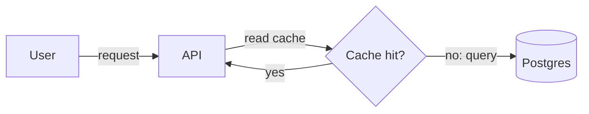
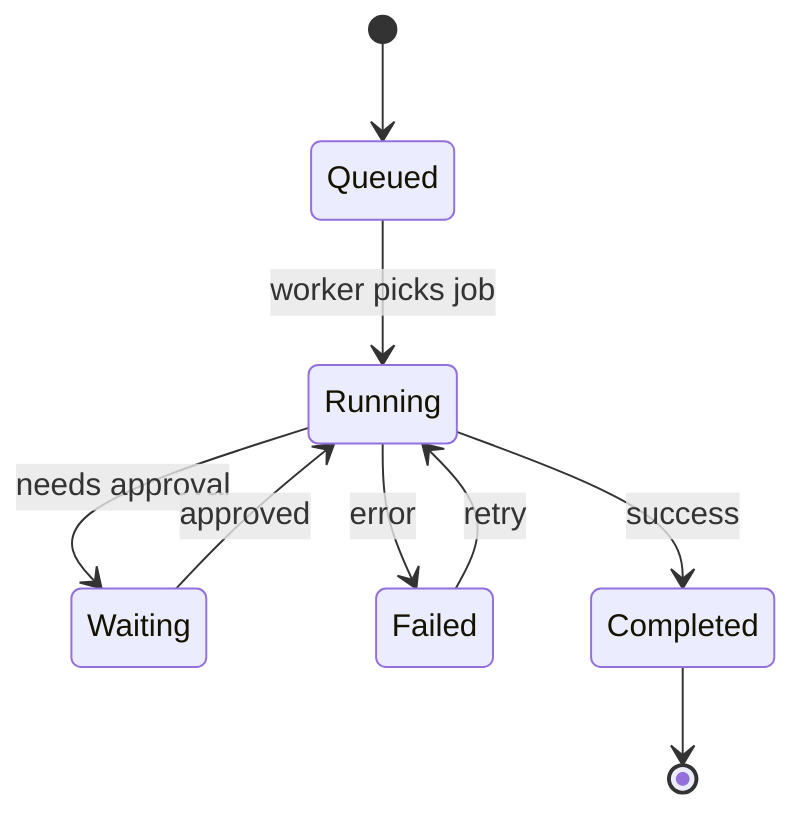
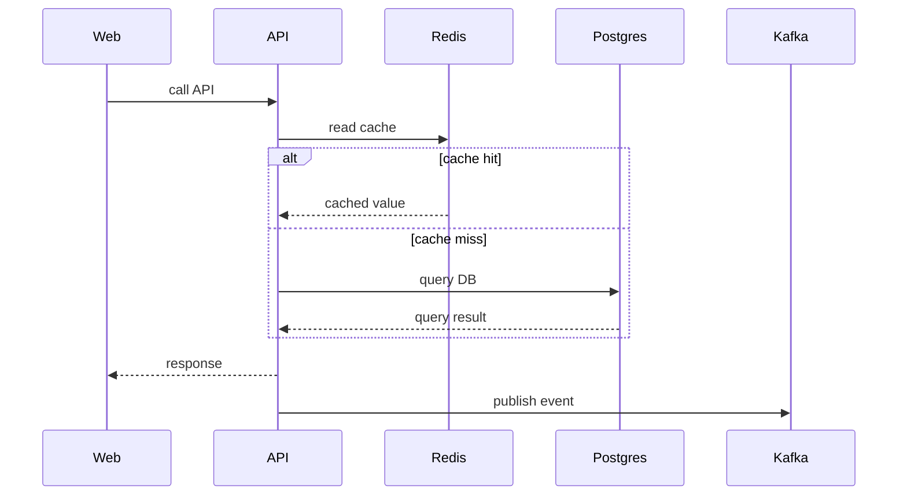
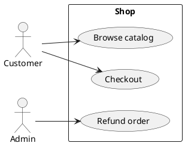

# Graph Language Guide

Use this reference after the skill triggers and the output format is not obvious
or an existing graph needs careful maintenance.

## Selection

Pick the graph type before picking syntax:

| User question                                            | Diagram type                | Best default                 |
| -------------------------------------------------------- | --------------------------- | ---------------------------- |
| Users, external systems, goals, product boundary         | Use case / context          | PlantUML usecase or Mermaid  |
| Components, modules, services, ownership, trust boundary | Architecture / C4           | D2                           |
| Human or operational steps, approvals, runbooks          | Workflow                    | Mermaid flowchart            |
| Request lifecycle, API calls, cache miss, retries        | Sequence                    | Mermaid sequence or PlantUML |
| Statuses, events, terminal outcomes                      | State / lifecycle           | Mermaid state or PlantUML    |
| Sources, transforms, stores, consumers, sensitivity      | Data flow / lineage         | D2                           |
| Hosts, clusters, networks, cloud resources               | Deployment / infrastructure | D2                           |

Use the user's requested syntax only after this routing decision. If a requested
syntax makes the graph worse, say so and choose the maintainable option unless
the user explicitly requires that syntax.

Default to the existing repo language. If none exists, default to Mermaid for
docs and D2 for polished architecture source.

## Mermaid Patterns

Use `flowchart LR` for workflows and simple context views. Use `stateDiagram-v2`
for lifecycle/status questions. Use `sequenceDiagram` for request lifecycles.
Do not show cache hits, retries, or returns as a knot of curved arrows.





Rules:

- Use semantic ids (`api`, `auth`, `orders_db`), not generated ids.
- Use `subgraph` only for real boundaries: deploy unit, trust boundary, team,
  network, stage, or data domain.
- Keep labels short. Move rationale and source evidence into comments or prose.
- Use edge labels for protocols, events, data assets, or conditions, not every
  step.
- Use decision nodes for branches such as cache hit/miss. Avoid drawing both
  request and response arrows in architecture flowcharts unless the return path
  changes control flow.
- For sequence diagrams, include returns only when the return value matters.
- For state diagrams, label transitions with events, not implementation notes.

For request lifecycles, this is often clearer than a flowchart:



## D2 Patterns

D2 works well when the graph needs explicit containers, deployment boundaries,
or polished architecture while remaining editable.

```d2
# Sources:
# api: services/api/src/main.rs:31
# prod: deploy/prod/*.yaml

prod: "prod cluster" {
  shape: rectangle

  ingress: Ingress
  api: API
  worker: Worker
  db: Postgres {
    shape: cylinder
  }
}

user: User
user -> prod.ingress: HTTPS
prod.ingress -> prod.api: REST
prod.api -> prod.db: SQL
prod.worker -> prod.db: jobs
```

Rules:

- Use containers for deploy, network, security, domain, or ownership boundaries.
- Use styles sparingly and never as the only carrier of meaning.
- Prefer stable ids and normal text labels over layout tricks.
- Run `d2 fmt` when available before finalizing touched D2 files.

Use D2 instead of Mermaid when a diagram needs to look polished in docs and the
repo does not require Mermaid.

## PlantUML Patterns

Use PlantUML when the repo already has it, when use cases are requested, or when
Mermaid sequence/state syntax is too cramped.



Rules:

- Keep participants stable across revisions.
- Group retries, alternatives, and failures only when they answer the user
  question.
- Avoid skinparam-heavy diagrams unless the repo already standardizes them.

## Traceability

Traceability can be inline comments, an adjacent Markdown note, or a table in
the same document.

Minimum useful evidence:

```text
id         source
web        apps/web/src/router.ts:12
api        services/api/src/main.rs:31
api->db    services/api/src/repository.rs:88
```

Use `source` for confirmed evidence, `assumption` for inferred structure, and
`open` for facts that still need verification.

For generated diagrams, keep the editable source as the primary artifact and
treat rendered images as build output.

## Quality Gate

Before final output, check:

- The chosen type answers the question: architecture, workflow, sequence,
  dataflow, or lifecycle.
- There is one obvious reading direction.
- Nodes represent stable concepts, not sentence fragments.
- Edge labels name protocols, events, data assets, or conditions.
- Branches are decisions, `alt` blocks, or states; not crossed return arrows.
- Every assumed or sourced fact has a trace entry.

If any check fails, revise the graph once before answering.
